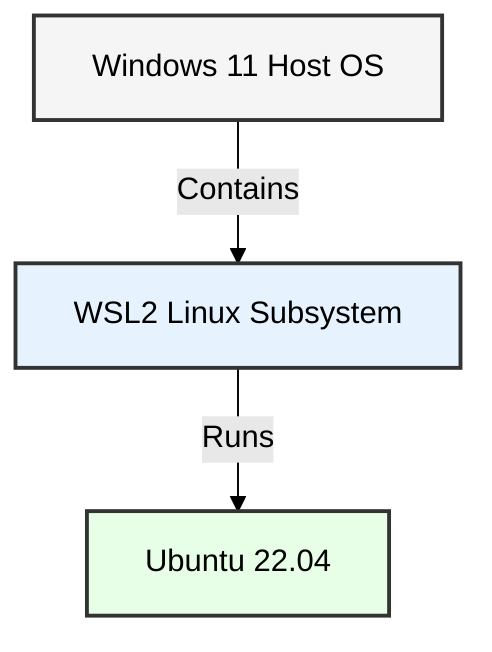
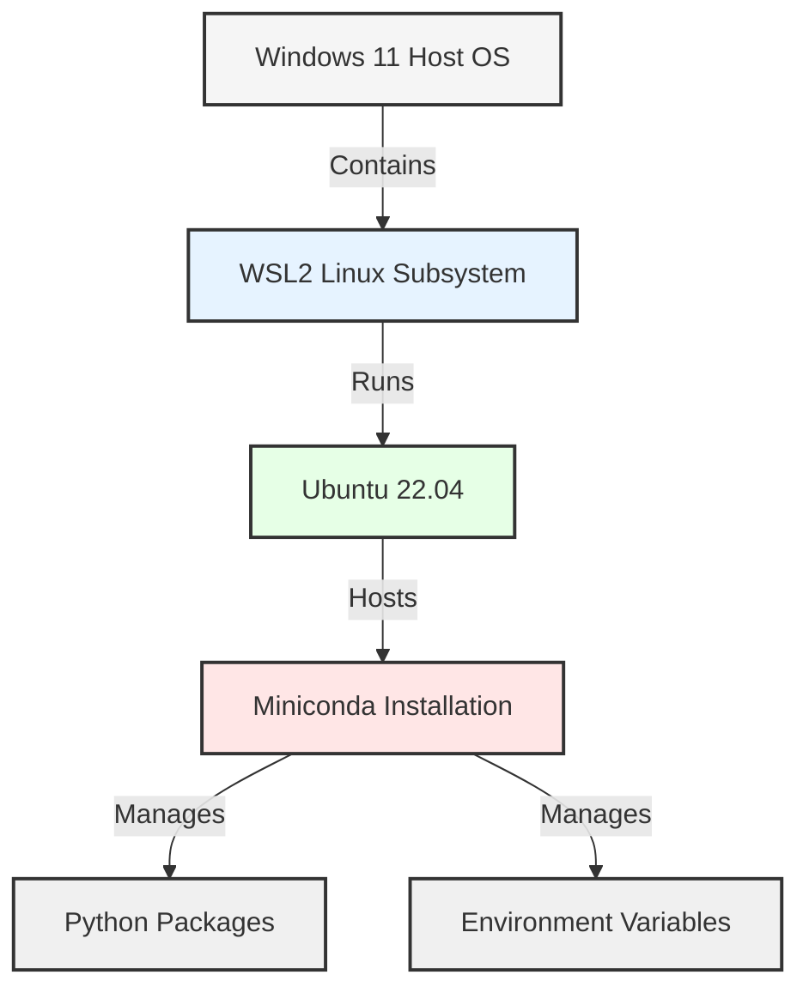
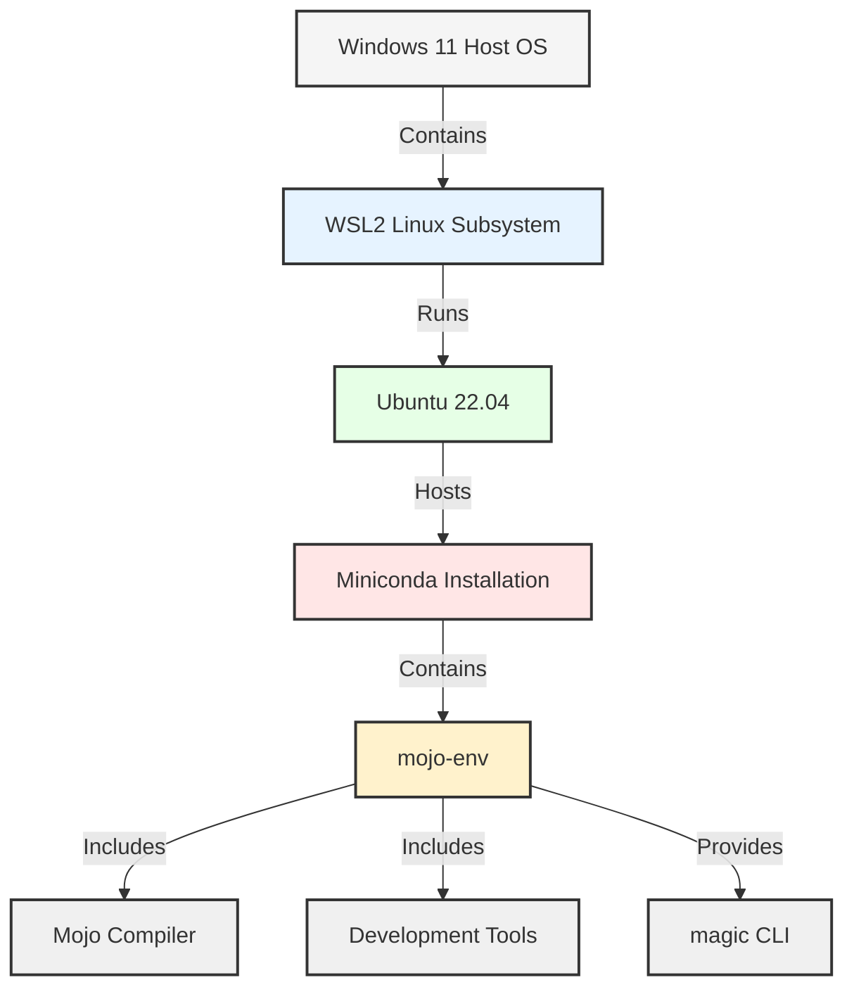

# Setting Up a Mojo Development Environment

This repository provides step-by-step instructions to set up **Mojo**, a cutting-edge programming language, in a Windows Subsystem for Linux (WSL2) environment using **Miniconda**. Whether you're a beginner or experienced developer, this guide ensures a seamless experience in building and using Mojo.


## Table of Contents

- Prerequisites
- Steps to Set Up the Mojo Environment
  - Install WSL2 and Update Ubuntu
  - Install Miniconda
  - Set Up the Mojo Environment
- Using the Mojo Environment
- Additional Notes

\newpage

## **Prerequisites**

Before starting, ensure you have thok e following:

1. **Windows 11** with WSL2 installed.
2. **Ubuntu (22.04 recommended)** running in WSL2.
3. **Internet Access**.

\newpage

## **Steps to Set Up the Mojo Environment**

### **Install WSL2 and Update Ubuntu**

Ensure WSL2 and Ubuntu are installed and up to date:

```bash
sudo apt update && sudo apt upgrade -y
```

#### **Diagram: System Overview**




### **Install Miniconda**

Miniconda is used to manage the Mojo environment.

#### **Download and Install Miniconda**

1. Download the Miniconda installer:

   ```bash
   wget https://repo.anaconda.com/miniconda/Miniconda3-latest-Linux-x86_64.sh
   ```

2. Run the installer:

   ```bash
   bash Miniconda3-latest-Linux-x86_64.sh
   ```

3. Follow the prompts:

   - Accept the license by typing `yes`.
   - Confirm the installation directory (recommended: `/home/<username>/miniconda3`).
   - Do not enable auto-activation unless desired.

4. Add Miniconda to your PATH:

   ```bash
   export PATH=~/miniconda3/bin:$PATH
   ```

5. Verify the installation:

   ```bash
   conda --version
   ```

#### **Diagram: WSL2 with Miniconda Installed**



\newpage

### **Set Up the Mojo Environment**

#### **Add Required Channels**

1. Configure Conda to use the necessary repositories:
   ```bash
   conda config --add channels conda-forge
   conda config --add channels https://conda.modular.com/max-nightly
   ```

#### **Create a Mojo Environment**

2. Create a Conda environment for Mojo:

   ```bash
   conda create -n mojo-env max -y
   ```

3. Activate the Mojo environment:

   ```bash
   conda activate mojo-env
   ```

4. Verify the `magic` CLI is installed:

   ```bash
   magic --version
   ```

   - You should see the version number, confirming a successful setup.

#### **Diagram: Conda Environment for Mojo**



\newpage

## **Using the Mojo Environment**

### **Activate the Environment**

To enter the Mojo environment:

```bash
conda activate mojo-env
```

### **Exit the Environment**

To deactivate the Mojo environment and return to the base system:

```bash
conda deactivate
```

### **Exit WSL2**

To completely leave the WSL2 environment:

```bash
exit
```

\newpage

## **Additional Notes**

- **Environment Isolation:** The Mojo environment is isolated from other Conda environments, ensuring dependencies do not conflict.

- **Auto-Activation:** If you want the environment to activate automatically, run:

  ```bash
  conda config --set auto_activate_base true
  ```

- **Uninstall Miniconda:** To completely remove Miniconda, delete its directory:

  ```bash
  rm -rf ~/miniconda3
  ```

This guide should help you set up and manage a reliable Mojo development environment.

